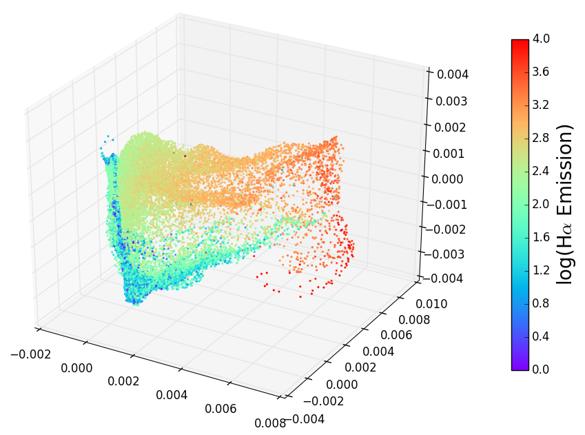
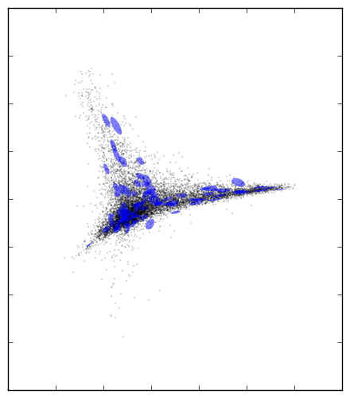

   

megaman: Manifold Learning for Millions of Points
=================================================

megaman is a scalable manifold learning package implemented in
python. It has a front-end API designed to be familiar
to `scikit-learn <http://scikit-learn.org/>`_ but harnesses
the C++ Fast Library for Approximate Nearest Neighbors (FLANN)
and the Sparse Symmetric Positive Definite (SSPD) solver
Locally Optimal Block Precodition Gradient (LOBPCG) method
to scale manifold learning algorithms to large data sets.
It is designed for researchers and as such caches intermediary
steps and indices to allow for fast re-computation with new parameters.

For issues & contributions, see the source 
`repository on github <http://github.com/mmp2/megaman/>`_.

For example notebooks see the 
`index on github <https://github.com/mmp2/megaman/blob/master/examples/examples_index.ipynb>`_.

You can also read our 
`arXiv paper <http://arxiv.org/abs/1603.02763>`_.

Documentation
=============

.. toctree::
   :maxdepth: 2

   installation
   geometry/index
   embedding/index
   utils/index
   images/index

Indices and tables
==================

* :ref:`genindex`
* :ref:`modindex`
* :ref:`search`
